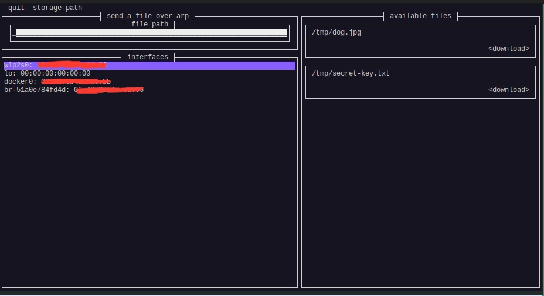

## floodfile

unsecure file transfer over arp - share your private-keys to the entire network!

## usage 

the application does it's best to catch all the packets but it's unreliable. smaller files have a higher chance of success.

1. choose your interface to share on
2. submit the relative or absolute path of the file to share
3. let your friend download it!

## installation

download the current release at the following [link](https://github.com/jrdwe/floodfile/releases/latest)

**linux**: `sudo setcap CAP_NET_RAW+ep floodfile` to set the correct network permissions

**windows**: you will require npcap with winpcap api to run the program

by default the application (if working correctly) saves files into your tmp directory. this can be changed via menubar.

## credit + motivation

this project was heavily inspired/adapted by [arpchat](https://github.com/kognise/arpchat) by kognise and was built to teach myself a little rust
