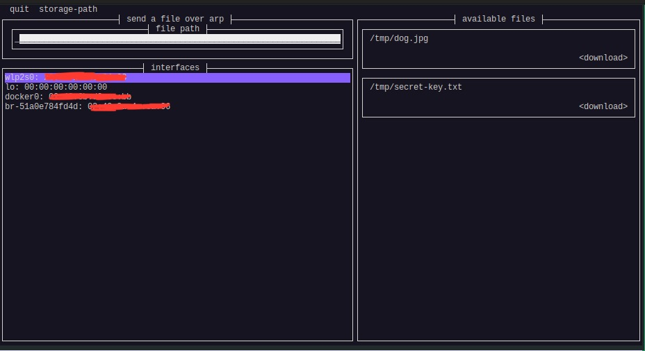

## floodfile

unsecure file transfer over arp - share your private-keys to the entire network!

## usage 

the application does it's best to catch every packet but it's super unreliable. very small files have a higher chance of success. large files are **very** loud over the network and probably won't work.

1. choose your interface to share on
2. submit the relative or absolute path of the file to share
3. let your friend download it!

## installation

download the current [release](https://github.com/jrdwe/floodfile/releases/latest) for your operating system

**linux**: set the correct network permissions w/ `sudo setcap CAP_NET_RAW+ep floodfile` 

**windows**: install either winpcap or npcap with winpcap api

by default the application (if working correctly) saves files into your tmp directory. this can be changed via the menubar.

## credit + motivation

this project was heavily inspired/adapted by [arpchat](https://github.com/kognise/arpchat) by kognise and was built to help myself learn rust
